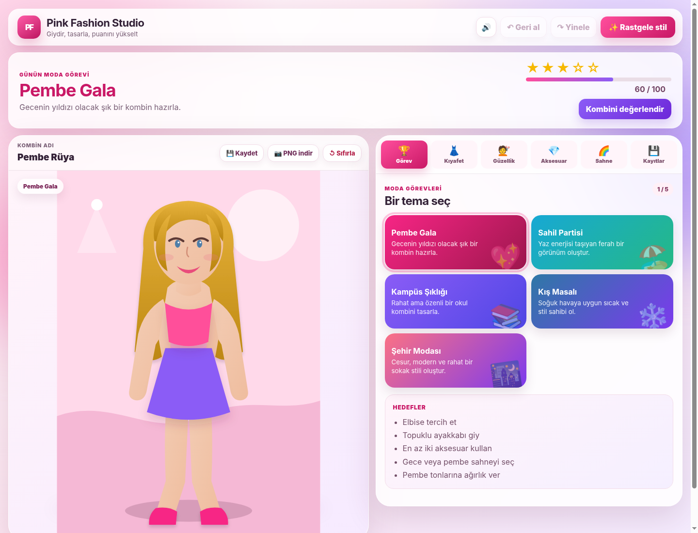

# Pink Fashion Studio 👗✨

Tarayıcıda çalışan, mobil uyumlu ve çevrimdışı kullanılabilen modern bir giydirmece oyunu. Proje yalnızca **HTML, CSS ve saf JavaScript** kullanır; kurulum veya paket yöneticisi gerektirmez.

> **Geliştiren:** Mert Demir  
> **Özel not:** Sude için sevgiyle yapılmıştır. 💗



<p align="center"></p>

## Özellikler

- Üst, alt, elbise, ceket ve ayakkabı seçenekleri
- Saç modeli, ten, saç, göz ve ruj renkleri
- Kolye, gözlük, taç, çanta ve küpe aksesuarları
- Beş farklı sahne ve beş temalı moda görevi
- Canlı görev puanı ve beş yıldızlı jüri değerlendirmesi
- Rastgele kombin oluşturma
- Geri al / yinele desteği
- Kombinleri tarayıcıya kaydetme ve tekrar yükleme
- Kombini yüksek çözünürlüklü PNG olarak indirme
- Klavye kısayolları ve erişilebilir buton durumları
- Responsive tasarım: masaüstü, tablet ve telefon
- PWA / Service Worker ile çevrimdışı çalışma
- GitHub Pages için hazır otomatik yayın workflow'u
- Harici kütüphane, görsel veya CDN bağımlılığı yok

## Yerelde çalıştırma

`index.html` dosyasını doğrudan açabilirsin. PWA ve çevrimdışı önbellek özelliklerini test etmek için yerel sunucu kullan:

```bash
python -m http.server 8080
```

Ardından tarayıcıda `http://localhost:8080` adresini aç.

## Tek tıkla GitHub'a yükleme

Windows'ta **`BASLAT_GITHUB_YUKLE.bat`** dosyasına çift tıkla. Script Git ve GitHub CLI eksikse otomatik kurar; güvenli tarayıcı girişiyle GitHub hesabına bağlanır, depoyu oluşturur, dosyaları gönderir ve GitHub Pages yayınını ayarlar. Sonraki değişiklikler için **`GITHUBA_GUNCELLE.bat`** kullanılır. Ayrıntılar: [`GITHUB_OTOMATIK_YUKLEME.md`](GITHUB_OTOMATIK_YUKLEME.md).

## GitHub'a yükleme

```bash
git init
git add .
git commit -m "Pink Fashion Studio ilk sürüm"
git branch -M main
git remote add origin https://github.com/KULLANICI_ADIN/DEPO_ADIN.git
git push -u origin main
```

## GitHub Pages ile yayınlama

1. Depoyu GitHub'a gönder.
2. **Settings → Pages** bölümüne gir.
3. **Source** alanında **GitHub Actions** seç.
4. `main` dalına gönderim yapıldığında `.github/workflows/pages.yml` otomatik yayın yapar.

Site adresi genellikle şu biçimde olur:

```text
https://KULLANICI_ADIN.github.io/DEPO_ADIN/
```

## Klavye kısayolları

| Kısayol | İşlev |
|---|---|
| `Ctrl/Cmd + Z` | Geri al |
| `Ctrl/Cmd + Shift + Z` | Yinele |
| `Ctrl/Cmd + S` | Kombini kaydet |
| `R` | Rastgele stil |

## Proje yapısı

```text
pink-fashion-studio/
├── .github/workflows/pages.yml
├── BASLAT_GITHUB_YUKLE.bat
├── GITHUBA_GUNCELLE.bat
├── tools/github-manager.ps1
├── assets/
│   ├── css/styles.css
│   ├── icons/
│   └── js/app.js
├── screenshots/
│   ├── preview.png
│   └── mobile-preview.png
├── index.html
├── manifest.webmanifest
├── sw.js
├── LICENSE
└── README.md
```

## Özelleştirme

Kıyafet ve görev verileri `assets/js/app.js` içindeki `data` nesnesinde bulunur. Renkler ve genel görünüm `assets/css/styles.css` dosyasının başındaki CSS değişkenlerinden değiştirilebilir.

## Geliştirici

**Mert Demir** tarafından geliştirilmiş ve **Sude için sevgiyle hazırlanmıştır.** 💗

## Lisans ve marka notu

Kod MIT lisansı ile sunulmaktadır. Bu proje hayran yapımı bir eğitim/portföy çalışmasıdır. **Mattel, Barbie veya bunların hak sahipleriyle bağlantılı değildir.** Depo adında ve açıklamasında yanıltıcı biçimde resmî ürün izlenimi oluşturulmaması önerilir.
